# Formula 1 Driving Style vs Performance

## Executive Summary

This project explores the relationship between Formula One driving style and performance in the last 50 years. This is based on K Means Clustering of the driver’s performance and grouped drivers into one of six clusters:

- **Elite Drivers**
- **Back-Markers**
- **Top Contenders**
- **Aggressive Risk Prone Drivers**
- **Consistent Midfielder**
- **Lower Midfield Fighters**
  
## Data Selection

The dataset **Formula 1 World Championship (1950 - 2024)** used for the project, sourced from Kaggle, included 14 CSV files however this project only utilised 5 of these. 

[Formula 1 World Championships (1950-2024)](https://www.kaggle.com/datasets/rohanrao/formula-1-world-championship-1950-2020). 

- ***drivers*** - 9 columns, 862 rows.
- ***qualifying*** - 9 columns, 10,494 rows.
- ***races*** - 18 columns, 1,125 rows.
- ***results*** - 18 columns, 26,759 rows.
- ***status*** - 2 columns, 139 rows.

### Loading and Initial Exploration

The five CSV files were imported into the Pandas DataFrame using the `pd.read_csv()` function.

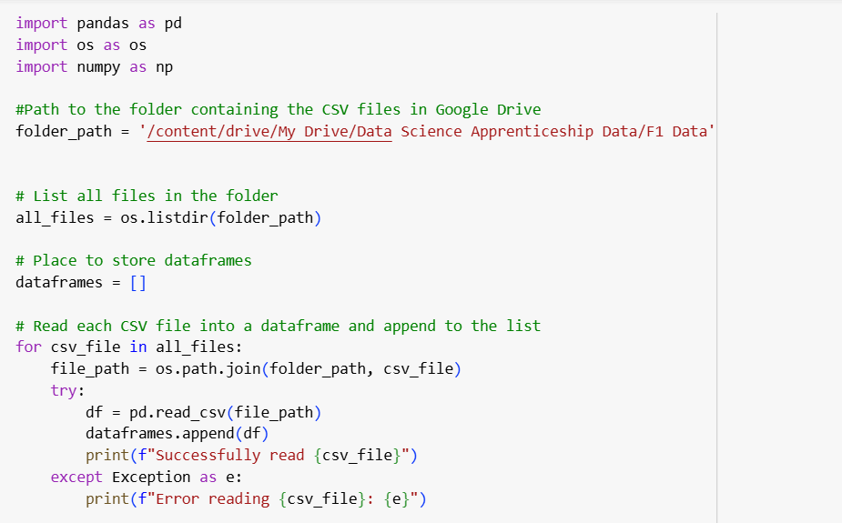

The initial stages of the analysis were to explore the quality of the dataset and merge the DataFrames together into one large DataFrame which contained all of the information from each CSV.

Following this, each dataframe was clearly named so it was easier to merge the dataframes on the correct keys. 

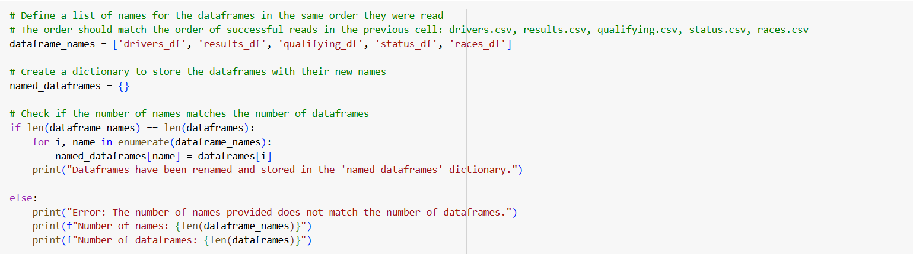

```python
# Access the dataframes from the named_dataframes dictionary
results_df = named_dataframes['results_df']
status_df = named_dataframes['status_df']
races_df = named_dataframes['races_df']
drivers_df = named_dataframes['drivers_df']
qualifying_df = named_dataframes['qualifying_df']

# Perform the first merge: results with status
merged_results_status = pd.merge(results_df, status_df, on='statusId', how='left')

# Perform the second merge: the result of the first merge with drivers
merged_results_driver = pd.merge(merged_results_status, drivers_df, on='driverId', how='left')

# Perform the third merge: the result of the second merge with races
merged_results_races = pd.merge(merged_results_driver, races_df, on='raceId', how='left')

# Perform the fourth merge: the result of the third merge with qualifying
final_merged_df = pd.merge(merged_results_races, qualifying_df, on=['raceId', 'driverId'], how='left')

print("Merged dataframes:")
display(final_merged_df.head())
```

### Data Selection, Renaming and Formatting

To focus on the relevant columns to create groups of Formula 1 Drivers, the following columns were selected:

***`selected_columns_df = final_merged_df[['raceId', 'year', 'date', 'name', 'driverId', 'driverRef', 'code', 'surname', 'forename', 'nationality', 'qualifyId', 'position_y', 'resultId', 'position_x', 'positionText', 'statusId', 'status', 'points']]`***

These columns were then renamed as follows to improve clarity and consistencty of the data: 

***`complete_df = selected_columns_df.rename(columns={'name': 'race_name', 'code': 'driver_code', 'position_y': 'grid_position', 'position_x': 'race_finish', 'positionText': 'race_finish_text'})`***

Finally, a couple of columns were adjusted to be numeric values:

***`complete_df['race_finish_numeric'] = pd.to_numeric(complete_df['race_finish'], errors='coerce')`***

***`complete_df['positions_gained'] =  complete_df['grid_position'] - complete_df['race_finish_numeric']`***

### Grouping and Adding Additional Metrics

The next step was to aggregate all the data until there was one row per driver_id, with columns being converted into a numeric format where necessary: 

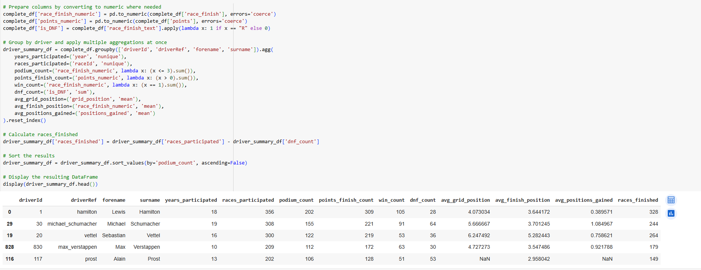

Following this, additional columns could be added which used the aggregated data from the previous step to create percentage performance for each driver on the following metrics:

- **races_finished** - races_participated - dnf_count
- **podium_finish_perc** - Podium_count/races_participated
- **points_finish_perc** - points_finish_count/races_participated
- **finish_rate** - races_finished/races_participated
- **win_rate** - win_count/races_participated

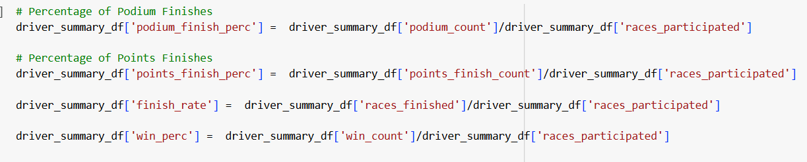

### Removing Drivers

To avoid issues where drivers had only participated in a few races and would show a 100% finish rate or a 100% points finish, any driver who participated in less than 30 races was removed:  

```python
driver_summary_df = driver_summary_df[driver_summary_df['races_participated'] > 30]
```

### Final Dataset

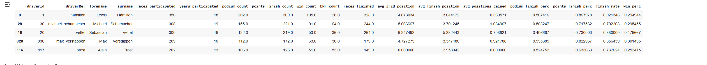

The resulting cleaned and standardised dataset could then be used for future processing, and contains the following columns: 

- **driver_id**
- **driverRef**
- **forename**
- **surname**
- **races_participated**
- **years_participated**
- **podium_count**
- **points_finish_count**
- **win_count**
- **DNF_count**
- **races_finished**
- **avg_grid_position**
- **avg_finish_position**
- **avg_positions_gained**
- **podium_finish_perc**
- **points_finish_perc**
- **finish_rate**
- **win_perc**

## Start the K Means Clustering Process

In this section, we go through the steps of using K Means Clustering to group drivers into different driving styles. This involved selecting the number of clusters to use and visualising this data.

### Loading the Cleaned Dataset

This step prepares the data for clustering by selecting relevant features and separating them from the driver names.

***driver_names = driver_summary_df['surname']***: This line extracts the 'surname' column from the driver_summary_df DataFrame and stores it in a new variable called driver_names. This is done to keep the driver names separate from the numerical features used for clustering.

***driver_features_df = driver_summary_df[['dnf_rate','points_finish_perc','podium_finish_perc', 'avg_positions_gained', 'avg_finish_position', 'avg_grid_position','years_participated','races_participated', 'wins_per_season']]***: This line creates a new DataFrame called driver_features_df by selecting specific columns from the driver_summary_df. These selected columns represent the features that will be used as input for the K-Means clustering algorithm.

***display(driver_features_df.head())***: This line displays the first five rows of the newly created driver_features_df DataFrame. This allows the user to preview the data that will be used for clustering and ensure that the correct columns have been selected.

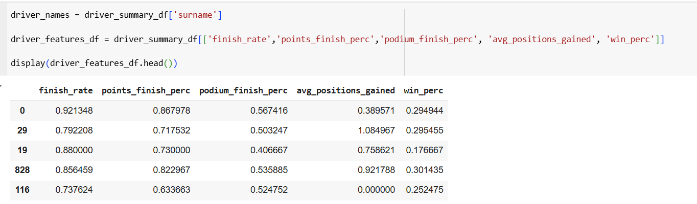

### Removing Missing Values and Scaling the Data

This code snippet handles potential missing values and scales the numerical features in the data, which are crucial steps before applying clustering algorithms.

***print("Missing values before handling:")*** and ***print(driver_features_df.isnull().sum())***: These lines check for and print the number of missing values in each column of the driver_features_df DataFrame before any handling is done to give a better idea of how complete the data is. 

This then creates a new DataFrame called ***driver_features_df_cleaned*** by removing any rows from the original ***driver_features_df*** that contain at least one missing value. This is a simple method for handling NaNs, and it's often used before clustering because many clustering algorithms are sensitive to missing data.

The DNF Rate has to be inverted before being scaled so that the lower rates are the higher scores otherwise it impacts the results.

The code is then scaling numeric features so that they're on an equal footing, so no single feature unfairly dominates the clustering. Without this scaling, clusters might look elongated along the axis with larger values.

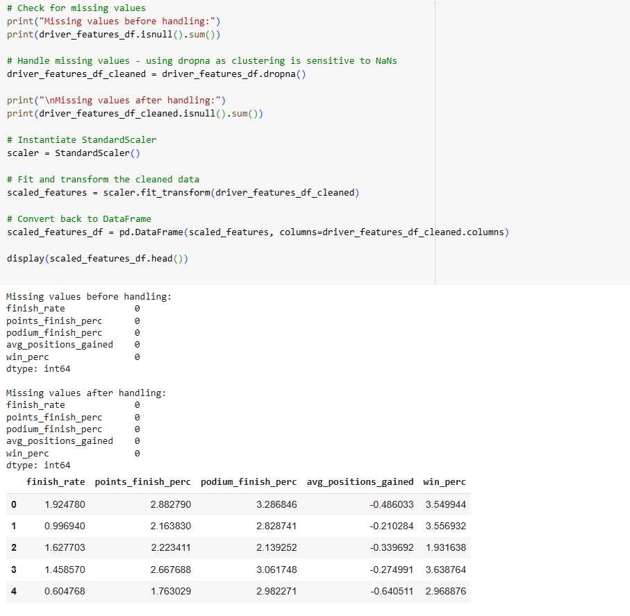

### Elbow Method

The next step is to us the Elbow Method to determine the optimal number of clusters (k). This stage ***k_range = range(1, 11)*** indicates the number of clusters that will be tested with ***for k in k_range: kmeans = KMeans(n_clusters=k, random_state=42, n_init=10)*** iterating through each stage.

The ***kmeans.fit(scaled_features_df)*** stage trains the model on the dataframe provided based on the features highighted earlier that we wanted to cluster on. Following this ***wcss.append(kmeans.inertia_)*** identifies how tightly the groups are clustered.

This is then plotted on the graph with the bend in the graph indicating the optimum number of clusters.

```python
wcss = []
k_range = range(1, 11)

for k in k_range:
    kmeans = KMeans(n_clusters=k, random_state=42, n_init=10)
    kmeans.fit(scaled_features_df)
    wcss.append(kmeans.inertia_)

# Plot the Elbow Method
plt.figure(figsize=(12, 5))
plt.subplot(1, 2, 1)
plt.plot(k_range, wcss, marker='o')
plt.xlabel('Number of clusters (k)')
plt.ylabel('WCSS')
plt.title('Elbow Method for Optimal k')
plt.xticks(k_range)
plt.grid(True)
```

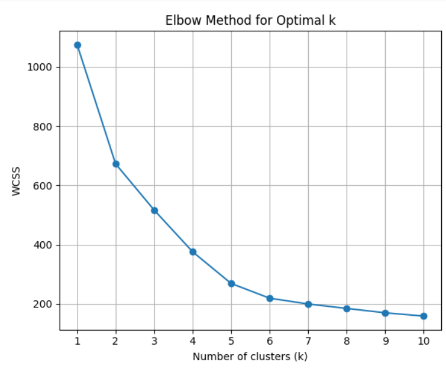

### Silhoutte Score

As the Elbow Method did not clearly define the best numbr of clusters, the silhouette method was used to help determine this as it also checks how far a cluster is from other clusters.

```python
wcss = []
silhouette_scores = []
k_range = range(1, 11)

for k in k_range:
    kmeans = KMeans(n_clusters=k, random_state=42, n_init=10)
    kmeans.fit(scaled_features_df)
    wcss.append(kmeans.inertia_)
    if k > 1:
        silhouette_scores.append(silhouette_score(scaled_features_df, kmeans.labels_))

# Plot the Silhouette Scores
plt.subplot(1, 2, 2)
plt.plot(k_range[1:], silhouette_scores, marker='o')
plt.xlabel('Number of clusters (k)')
plt.ylabel('Silhouette Score')
plt.title('Silhouette Scores for Optimal k')
plt.xticks(k_range[1:])
plt.grid(True)
```

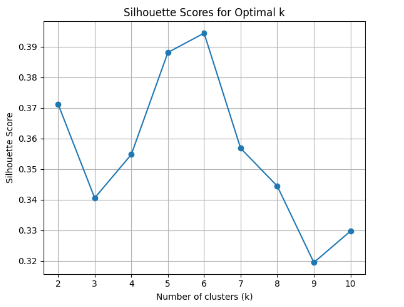

### Fitting the Data into Clusters

This step is taking the information from the last step by and uses k-means to use 6 clusters as this is the optimum number based on both the elbow method and the silhoutte score.

***kmeans = KMeans(n_clusters=k, random_state=42, n_init=20)*** initialises the K-Means model with the chosen number of clusters, telling it to run 20 times and pick the best result. 

***driver_summary_df['Cluster'] = kmeans.fit_predict(driver_features_df_cleaned):*** - This line is the most important as it trains the K Means model on the numerical metrics that we used earlier to group the drivers and then uses this training to assign a cluster to each of the drivers.

```python
# Fit KMeans with chosen k
k = 6
kmeans = KMeans(n_clusters=k, random_state=42, n_init=20)  # Added n_init for clarity

driver_summary_df['Cluster'] = kmeans.fit_predict(driver_features_df_cleaned)

# Calculate the mean stats for each cluster
cluster_summary = (
    driver_summary_df
    .groupby('Cluster')[['finish_rate','points_finish_perc','podium_finish_perc',
                         'avg_positions_gained','win_perc']]
    .mean()
    .round(2)
)

perc_cols = ['finish_rate', 'points_finish_perc', 'podium_finish_perc', 'win_perc']

# Convert to percentages
cluster_summary[perc_cols] = cluster_summary[perc_cols] * 100

# Make table print on one line
pd.set_option('display.max_columns', None)
pd.set_option('display.width', 1000)

print(cluster_summary)
```
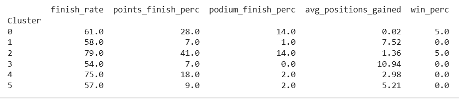

### Naming Clusters

Giving names to the cluster labels helps to show them as more distinguishable clusters and then displaying the cluster name agaisnt each of the drivers to see where they fall clearly shows each drivers performance style.

```python
# Updated cluster labels
cluster_labels = {
    0: 'Elite Drivers',
    1: 'Back-Markers',
    2: 'Top Contendors',
    3: 'Aggressive Risk Prone Drivers',
    4: 'Consistent Midfielders',
    5: 'Lower Midfield Fighters'
}

driver_summary_df['Driver Type'] = driver_summary_df['Cluster'].map(cluster_labels)

print(cluster_summary)

# Features to show
stats_cols = [
    'surname', 'Cluster', 'Driver Type',
    'finish_rate','points_finish_perc','podium_finish_perc',
    'avg_positions_gained', 'avg_finish_position', 'avg_grid_position',
    'win_perc'
]

# Print full table of actual stats + cluster info
pd.set_option('display.max_columns', None)
pd.set_option('display.width', 1000)
display(driver_summary_df[stats_cols].sort_values('Cluster'))
```

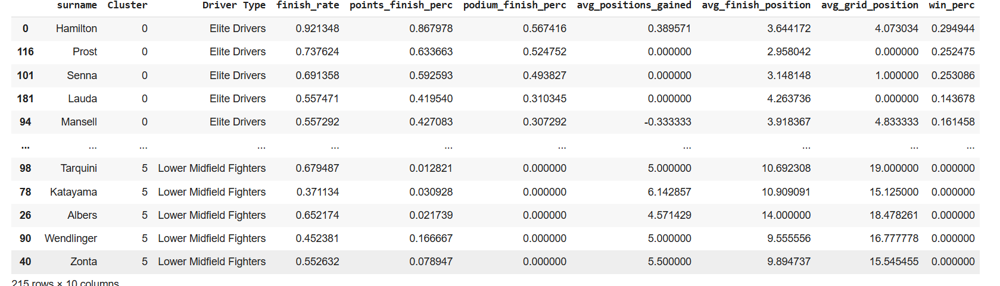

### Results and Analysis

To understand the effectiveness of the results a PCA (Principal Component Analysis) loadings plot was generated which showed the how the features contribute to the clusters and which are the most influentual.

Taking the square root helps scale the contributions properly so they reflect the actual influence.This gives a final score for how much each feature contributes to PC1 and PC2. These can now be plotted on a graph.

Features which are far from the origing 0.0 have a strong influence on the results and if two features are close together they behave simlarily

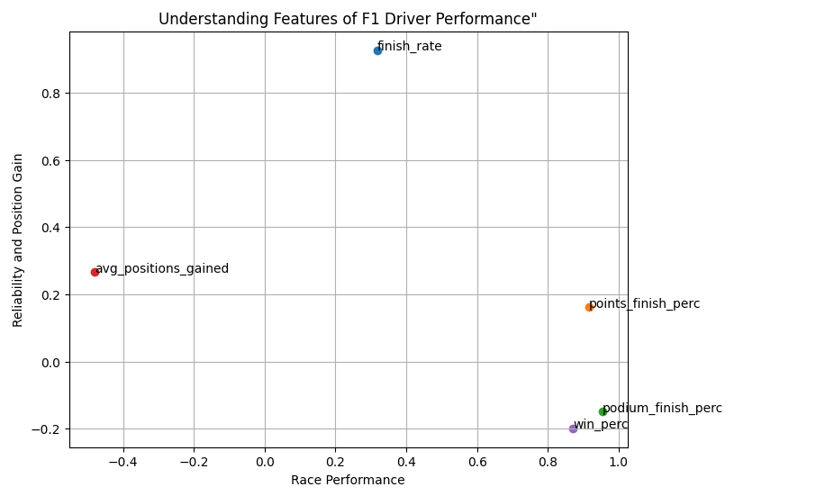

This logic was then applied to the clusters to see where a driver fell based on the two parameters to understand what was the most influential factor for each driver. 

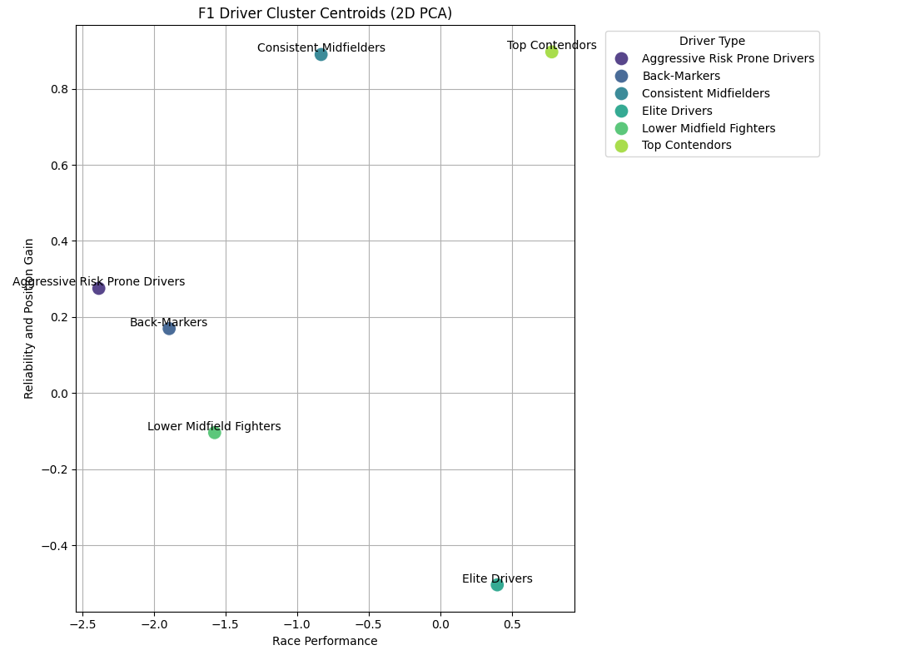

## Recommendations

1. **Repeat with different features :** A lot of the clusters overlap one another which suggests the features are not ideal for seperating the groups and may benefit from iterating the process of picking different features so that better defined clusters can be identified.

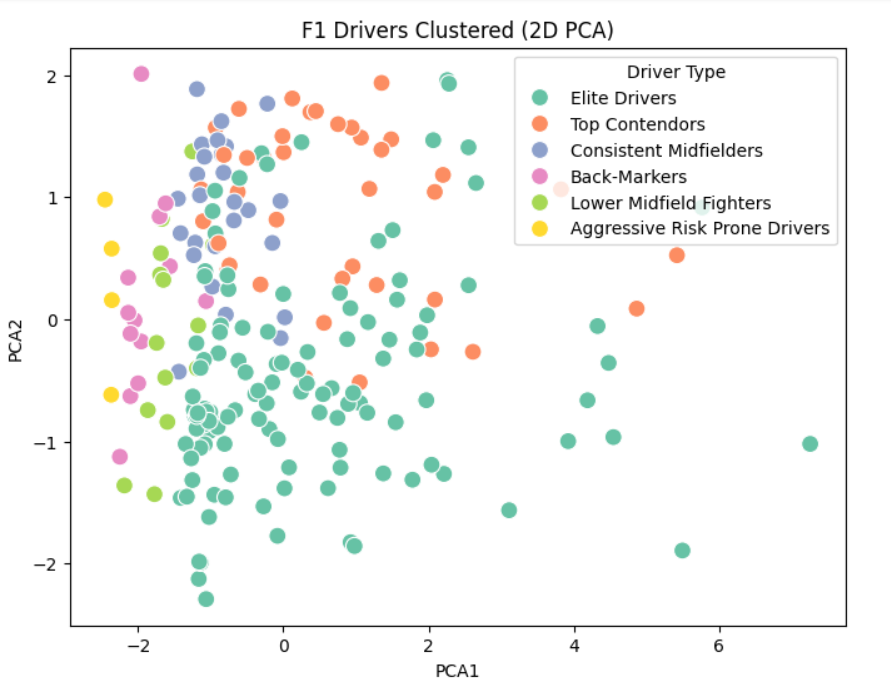


## References

1. [Formula 1 World Championships (1950-2024)](https://www.kaggle.com/datasets/rohanrao/formula-1-world-championship-1950-2020). 

