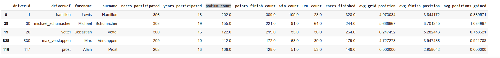

# Formula 1 Driving Style vs Performance

## Executive Summary

This project explores the relationship between Formula One driving style and performance from the last 50 years. This is based on K Means Clustering of the driver’s performance and grouped drivers into one of six clusters:

- **Elite Drivers**
- **Back-Markers**
- **Top Contenders**
- **Aggressive Risk Prone Drivers**
- **Consistent Midfielder**
- **Lower Midfield Fighters**
  
## Data Selection

The dataset **Formula 1 World Championship (1950 - 2024)** used for the project, sourced from Kaggle, included 14 CSV files however this project only utilised 5 of these. [Formula 1 World Championships (1950-2024)](https://www.kaggle.com/datasets/rohanrao/formula-1-world-championship-1950-2020). 

- ***drivers*** - 9 columns, 862 rows.
- ***qualifying*** - 9 columns, 10,494 rows.
- ***races*** - 18 columns, 1,125 rows.
- ***results*** - 18 columns, 26,759 rows.
- ***status*** - 2 columns, 139 rows.

### Loading and Initial Exploration

The five CSV files were imported into the Pandas DataFrame using the `pd.read_csv()` function.


The initial stages of the analysis were to explore the quality of the dataset and merge the DataFrames together into one large DataFrame which contained all of the information from each CSV.

```python
# Access the dataframes from the named_dataframes dictionary
results_df = named_dataframes['results_df']
status_df = named_dataframes['status_df']
races_df = named_dataframes['races_df']
drivers_df = named_dataframes['drivers_df']
qualifying_df = named_dataframes['qualifying_df']

# Perform the first merge: results with status
merged_results_status = pd.merge(results_df, status_df, on='statusId', how='left')

# Perform the second merge: the result of the first merge with drivers
merged_results_driver = pd.merge(merged_results_status, drivers_df, on='driverId', how='left')

# Perform the third merge: the result of the second merge with races
merged_results_races = pd.merge(merged_results_driver, races_df, on='raceId', how='left')

# Perform the fourth merge: the result of the third merge with qualifying
final_merged_df = pd.merge(merged_results_races, qualifying_df, on=['raceId', 'driverId'], how='left')

print("Merged dataframes:")
display(final_merged_df.head())
```

### Data Selection, Renaming and Formatting

To focus on the relevant columns for create groups of Formula 1 Drivers, the following columns were selected:

`selected_columns_df = final_merged_df[['raceId', 'year', 'date', 'name', 'driverId', 'driverRef', 'code', 'surname', 'forename', 'nationality', 'qualifyId', 'position_y', 'resultId', 'position_x', 'positionText', 'statusId', 'status', 'points']]`

These columns were  then renamed as follows to improve clarity and consistencty of the data: 

`complete_df = selected_columns_df.rename(columns={'name': 'race_name', 'code': 'driver_code', 'position_y': 'grid_position', 'position_x': 'race_finish', 'positionText': 'race_finish_text'})`

Finally, a couple of columns were adjusted to be numeric values:

`complete_df['race_finish_numeric'] = pd.to_numeric(complete_df['race_finish'], errors='coerce')`

`complete_df['positions_gained'] =  complete_df['grid_position'] - complete_df['race_finish_numeric']`

### Grouping and adding Additional Metrics

The next step was to aggregate all the data until there was one row per driver_id:



Following this, additional columns could be added which used the aggregated data from the previous step to create percentage performance for each driver on the following metrics:

- **podium_finish_perc** - Podium_count/races_participated
- **oiints_finish_perc** - points_finish_count/races_participated
- **finish_rate** - races_finished/races_participated
- **win_rate** - win_count/races_participated


### Removing Drivers

To avoid issues where drivers had only participated in a few races and would show a 100% finish rate or a 100% points finish, any driver who participated in less than 30 races was removed:  

```python
driver_summary_df = driver_summary_df[driver_summary_df['races_participated'] > 30]
```

### Final Dataset


The resulting cleaned and standardized dataset could then be used for future processing, and contains the following columns: 

- **driver_id**
- **driverRef**
- **forename**
- **surname**
- **races_participated**
- **years_participated**
- **podium_count**
- **points_finish_count**
- **win_count**
- **DNG_count**
- **races_finished**
- **avg_grid_position**
- **avg_finihs_position**
- **avg_positions_gained**
- **podium_finish_perc**
- **points_finish_perc**
- **finish_rate**
- **win_perc**

## Start the K Means Clustering Process

In this section, we walk through the steps of using K Means Clustering to group drivers into different driving styles. This involved selecting the number of clusters to use and visualising this data.

### Loading the Cleaned Dataset

This step prepares the data for clustering by selecting relevant features and separating them from the driver names.

***driver_names = driver_summary_df['surname']***: This line extracts the 'surname' column from the driver_summary_df DataFrame and stores it in a new variable called driver_names. This is done to keep the driver names separate from the numerical features used for clustering.

***driver_features_df = driver_summary_df[['dnf_rate','points_finish_perc','podium_finish_perc', 'avg_positions_gained', 'avg_finish_position', 'avg_grid_position','years_participated','races_participated', 'wins_per_season']]***: This line creates a new DataFrame called driver_features_df by selecting specific columns from the driver_summary_df. These selected columns represent the features that will be used as input for the K-Means clustering algorithm.

***display(driver_features_df.head())***: This line displays the first five rows of the newly created driver_features_df DataFrame. This allows the user to preview the data that will be used for clustering and ensure that the correct columns have been selected.


### Removing Missing Values and Scaling the Data

This code snippet handles potential missing values and scales the numerical features in the data, which are crucial steps before applying clustering algorithms.

***print("Missing values before handling:") and print(driver_features_df.isnull().sum())***: These lines check for and print the number of missing values in each column of the driver_features_df DataFrame before any handling is done.This gives you an initial assessment of the data's completeness.

This then creates a new DataFrame called *driver_features_df_cleaned* by removing any rows from the original *driver_features_df* that contain at least one missing value. This is a simple method for handling NaNs, and it's often used before clustering because many clustering algorithms are sensitive to missing data.

The code then is scaling numeric features so that they're on the same scale, which is especially useful for machine learning algorithms that are sensitive to differences in magnitude between features. This puts all features on equal footing, so no single feature unfairly dominates the clustering. Without this scaling, clusters might look elongated along the axis with larger values.

After scaling, all features contribute equally to determining cluster membership, leading to more meaningful and balanced clusters. The DNF Rate has to be inverted before being scaled so that the lower rates are the higher scores otherwise it impacts the results.
```python
random_seed = 42
random.seed(random_seed)

shuffled_df = df.sample(frac=1, random_state=random_seed)

num_samples = 100
random_subset = shuffled_df.head(num_samples)
```


### Knapsack Problem Solver

We initialize the Knapsack Solver with the desired solver type and set the capacity of the knapsack (maximum weight allowed). 
This solver type is suitable for multidimensional problems.

```python
solver = knapsack_solver.KnapsackSolver(
    knapsack_solver.SolverType.KNAPSACK_MULTIDIMENSION_BRANCH_AND_BOUND_SOLVER,
    "KnapsackExample",
)

# Capacity of the knapsack (maximum weight allowed)
capacity = 25000
```

### Preparing Data for the Solver

We prepare the data for the solver by converting weights and values to integers as required by OR-Tools. 
The number of items in the subset is also determined.

```python
weights = random_subset['weight_kg'].tolist()
values = random_subset['price'].tolist()

# Convert weights and values to integers (required by OR-Tools)
weights = [int(w * 1000) for w in weights]  # Convert to grams (integer)
values = [int(v * 100) for v in values]  # Convert to currency (integer)

# Number of items
num_items = len(random_subset)
```

### Solver Initialization and Solution

We initialize the solver with the prepared data and solve the Knapsack Problem to find the selected items (1 for selected, 0 for not selected).

```python
# Set the solver parameters
solver.init(values, [weights], [capacity])
solver.solve()

# Get the selected items (1 for selected, 0 for not selected)
selected_items = [solver.best_solution_contains(i) for i in range(num_items)]
```

### Results and Analysis

We present the output, and verify the results by summing the total price and weight. 
In this step, we encounter a discrepancy in the total weight, which prompts further investigation.


### Addressing Discrepancy

We address the discrepancy by converting the 'kg' weight column into grams. 
After performing the conversion and re-sampling, we solve the Knapsack Problem again.

```python
def convert_grams(weight_kg):
    weight_grams = math.ceil(weight_kg * 1000)

    try:
        return int(weight_grams)
    except ValueError:
        return None

df['weight_grams'] = df['weight_kg'].apply(convert_grams)
```

### Reanalysis of Results

We reanalyze the results with the converted weight in grams, including the total weight in kilograms and grams.
The discrepancy still exists, but the solver does get the total weight below the target of 25,000 grams or 25kg


## Recommendations for Future Iterations

1. **Multiple Knapsacks:** Future iterations of this project could expand from solving a single knapsack problem to solving multiple knapsacks simultaneously. This would be valuable for scenarios where there are multiple constraints or resources to consider.

2. **Complex Packing Problems:** Consider tackling more complex packing problems, such as 2D or 3D bin packing, which have practical applications in logistics, manufacturing, and resource allocation.

## Challenges Encountered

One challenge encountered during the project was dealing with floating-point arithmetic limitations, which can affect the precision of calculations when working with values like weights and prices.
While the discrepancy is small enough for this project, it's essential to be aware of such limitations in real-world applications.

## References

1. [Amazon Product Dataset 2020](https://www.kaggle.com/datasets/promptcloud/amazon-product-dataset-2020)
2. [Google OR-Tools Documentation](https://developers.google.com/optimization/pack/knapsack)
3. Medium Articles:
   - [Exploring the Bin Packing Problem](https://medium.com/swlh/exploring-the-bin-packing-problem-f54a93ebdbe5)
   - [The Knapsack Problem: A Guide to Solving One of the Classic Problems in Computer Science](https://levelup.gitconnected.com/the-knapsack-problem-a-guide-to-solving-one-of-the-classic-problems-in-computer-science-7b63b0851c89)
